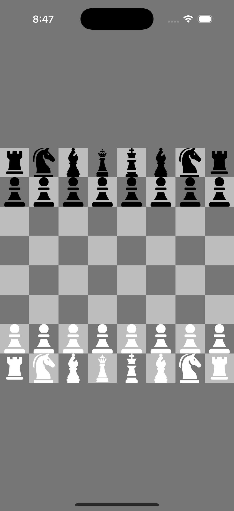
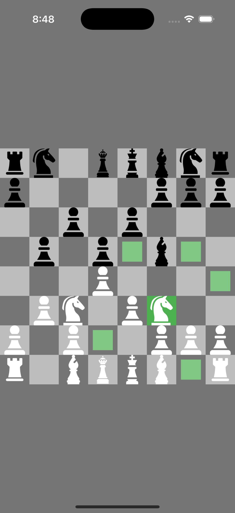

# ♟️ Flutter Chess Game

A fully functional, two-player local chess game developed using the Flutter framework.

## ✨ Features

- 🎨 Visually appealing 8x8 chessboard UI with distinct square coloring.
- ♟️ Accurate movement logic for all chess pieces:
  - Pawn (with basic promotion),
  - Rook, Knight, Bishop, Queen, King
- ✅ Move validation to ensure legal plays.
- 🔍 Piece selection and highlighting of valid moves.
- ⚔️ Basic capture logic and tracking of captured pieces.
- 🧠 Game state management:
  - Check and Checkmate detection
  - Game reset functionality
- 📱 Clean touch interaction using Flutter's gesture system.

## 🚀 Tech Stack

- **Flutter** – For UI rendering and app structure
- **Dart** – Core logic and state management

## 🛠️ Future Enhancements

- ⏳ Implement castling and en passant moves
- 🤖 Add single-player mode with AI opponent
- 💾 Save and load game state
- 🔄 Undo/Redo functionality
- 🌐 Online multiplayer support

## 📷 Screenshots

| Board View | Valid Move Highlight |
|------------|----------------------|
|  |  |


## 🧪 How to Run

```bash
git clone https://github.com/Arsalan-Chang/chess-game.git
cd chess-game
flutter pub get
flutter run
